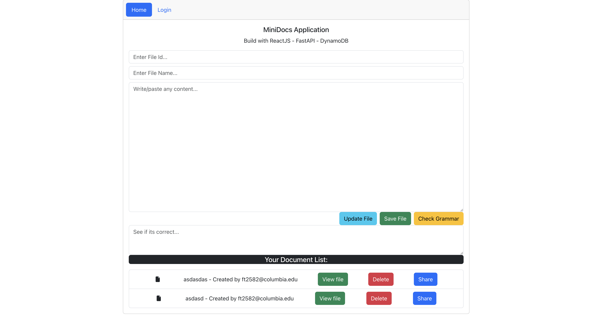

# MiniDocs Project Readme

## Overview

MiniDocs is a cloud-native application designed to facilitate document management. Developed by the E6156 - Topics in SW Engineering Management: Cloud Computing team at Columbia University, this project offers an efficient and user-friendly way to manage documents in the cloud.

  

### Project Links
- **Live Website:** [Visit Site](http://minidocs-frontend.s3-website.us-east-2.amazonaws.com/)
- **Demo Videos:** [Google Drive Folder](https://drive.google.com/drive/folders/1jZe3mKxKsFEuq3tAHfAvhYmKbLEuqPyO?usp=sharing)

## Physical View

  

## Key Features

MiniDocs allows users to:

- Login using their Columbia/Google email address.
- Perform Create, Read, Update, Delete (CRUD) operations on documents they own.
- Share documents with other users via email.
- Receive email notifications for updates or shares.

### Document Features

- CRUD operations.
- Grammar checks via an External Grammar API microservice.

### Notification System

- Amazon SNS triggers emails for file updates or shares.

### User Roles

- **Owner:** Manages their own files.
- **Viewer:** Accesses files shared with them.

## Technical Architecture

### Services

1. **Document Service (Container):**
   - Manages document creation, editing, storage, content, and permissions.

2. **User Authentication and Authorization Service (Google Cloud):**
   - Handles user authentication, authorization, and access control.

3. **Document Utility Service (EC2):**
   - API utility service for grammar checks on document text.

4. **Notification System (EC2):**
   - Email notifications via SNS topics and Lambda functions.

5. **GraphQL:**
   - Basic GraphQL application for querying user data.

### Resource Paths

- `/api/docs`: OpenAPI documentation.
- `/files`: Document management.
- `/auth`: User authentication.
- `/users`: User management.
- `/grammarcheck`: Grammar check service.
- `/share`: Document sharing.

### Agile Project

- Managed using Agile methodologies.

### Codebase

- **Front-End:** [GitHub Repository](https://github.com/OchirnyamB/MiniDocs-E6156-CloudComputing-FrontEnd)
- **Document Service:** [GitHub Repository](https://github.com/Foris8/MiniDocs-E6156-Document-Service)
- **Document Utility Service:** [GitHub Repository](https://github.com/OchirnyamB/MiniDocs-E6156-CloudComputing-BackEnd-UtilityService)
- **User Authentication:** [GitHub Repository](https://github.com/chiayen0119/MiniDocs-E6156-Authentication-Service)
- **Project Board:** [GitHub Project](https://github.com/users/OchirnyamB/projects/2)
- **GraphQL:** [GitHub Repository](https://github.com/chiayen0119/MiniDocs-E6156-GraphQL)

### Links to Deployment

- **Frontend (S3):** [Visit Site](http://minidocs-frontend.s3-website.us-east-2.amazonaws.com/)
- **Document Backend (EC2):** [Visit Site](http://ec2-3-90-184-240.compute-1.amazonaws.com/documents/)
- **Authentication Backend (GCP):** [Visit Site](https://minidocs-e6156-cloudcomputing.ue.r.appspot.com/)
- **External Backend API (EC2):** [Visit Site](http://ec2-18-221-160-18.us-east-2.compute.amazonaws.com/)

## Conclusion

MiniDocs represents a comprehensive solution for cloud-based document management, emphasizing ease of use, security, and efficient document handling. This project is a testament to the collaborative effort and technical expertise of the E6156 team.